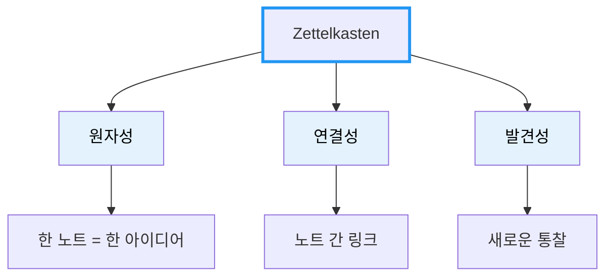

# Zettelkasten Note Writer

**원자적 노트로 지식을 연결하는 Obsidian 노트 작성 가이드**

---

## 핵심 철학

### 왜 Zettelkasten인가?

기존 노트 방식의 문제:
- 폴더에 묻혀 다시 보지 않는 노트
- 검색해도 찾기 어려운 정보
- 지식이 고립되어 새로운 통찰 불가

Zettelkasten의 해결책:
- **원자성**: 한 노트 = 한 아이디어 → 재사용 가능
- **연결성**: 노트 간 링크 → 지식 네트워크 형성
- **발견성**: 연결을 따라가며 새로운 통찰 발견

### 절대 하지 말 것
```
❌ 한 노트에 여러 개념 담기
❌ 존재하지 않는 노트로 링크 생성
❌ 출처 없이 정보 기록
❌ 복사-붙여넣기만 하고 재해석 없음
```

### 반드시 할 것
```
✅ 한 노트에 하나의 핵심 아이디어만
✅ 링크 전 해당 노트 존재 여부 확인
✅ 나의 언어로 재해석하여 작성
✅ 최소 1개 이상의 관련 노트와 연결
```

---

## 기본 설정

| 항목 | 경로/규칙 |
|------|-----------|
| Vault 경로 | `~/Library/Mobile Documents/iCloud~md~obsidian/Documents/Note` |
| 템플릿 위치 | `99.Template/Zettelkasten` |
| 저장 위치 | `00.Inbox` |
| 파일명 규칙 | `주제명.md` (예: `RAG시스템.md`) |

---

## 노트 유형

### 1. Fleeting Note (순간 메모)
- 떠오르는 생각을 빠르게 기록
- 나중에 Permanent Note로 발전시키거나 삭제
- 저장 위치: `00.Inbox`

### 2. Literature Note (문헌 노트)
- 책, 강의, 아티클에서 얻은 정보
- 반드시 출처 명시
- 원문 인용 + 나의 해석 포함

### 3. Permanent Note (영구 노트)
- 완전히 내 언어로 재해석된 지식
- 다른 노트와 연결
- Zettelkasten의 핵심

---

## 노트 구조

### Frontmatter 템플릿

```yaml
---
title: 명확하고 구체적인 제목
source: 출처 URL 또는 책 제목
topics:
  - 주제1
  - 주제2
related_notes:
  - "[[실존하는_노트1]]"
  - "[[실존하는_노트2]]"
tags:
  - 태그1
  - 태그2
created: YYYY-MM-DD
---
```

### 본문 구조

```markdown
## 핵심 아이디어
> 이 노트의 핵심을 한 문장으로 요약

## 상세 설명
개념을 2-3 문단으로 자세히 설명.
왜 이것이 중요한지, 어떻게 동작하는지.

## 연결 고리
- [[관련노트1]]과의 관계: ...
- [[관련노트2]]와 비교하면: ...

## 예시
구체적인 사례나 코드 예시

## 더 알아보기
- 추가 학습 질문
- 탐구할 방향
```

---

## 작성 프로세스

### 1단계: 사전 조사
```markdown
□ 동일/유사 주제의 기존 노트 검색
□ 연결 가능한 관련 노트 식별
□ 노트 범위를 원자적 단위로 제한
```

### 2단계: 초안 작성
```markdown
□ 핵심 아이디어 한 문장 작성
□ 나의 언어로 재해석하여 설명
□ 출처 명시
```

### 3단계: 연결 구축
```markdown
□ 관련 노트 링크 추가 (실존 확인!)
□ 양방향 연결 고려
□ 연결의 이유/관계 명시
```

### 4단계: 시각화 (필요시)
```markdown
□ 복잡한 개념은 mermaid 다이어그램으로
□ 가독성 있는 스타일 적용
```

---

## 연결 패턴

### 언제 링크하는가?

| 관계 유형 | 설명 | 예시 |
|-----------|------|------|
| **상위-하위** | 일반 개념 ↔ 구체 개념 | [[데이터베이스]] → [[인덱스]] |
| **원인-결과** | A가 B를 야기 | [[N+1문제]] → [[성능저하]] |
| **비교-대조** | 유사하지만 다른 개념 | [[SQL]] ↔ [[NoSQL]] |
| **구현-적용** | 이론 → 실제 적용 | [[SOLID원칙]] → [[리팩토링사례]] |
| **선행-후행** | 순서 관계 | [[기본문법]] → [[고급패턴]] |

### 링크 작성 규칙

```markdown
✅ 좋은 예:
- [[캐시]]와의 관계: Redis는 캐시의 대표적인 구현체다.

❌ 나쁜 예:
- [[캐시]] (설명 없이 링크만)
- [[아직없는노트]] (존재하지 않는 노트)
```

**링크 대안**: 존재하지 않는 노트는 `topics`나 `tags`로 대체

---

## Mermaid 시각화 가이드

### 다이어그램 유형 선택

| 상황 | 다이어그램 |
|------|-----------|
| 프로세스/흐름 | `flowchart` |
| 시간순 상호작용 | `sequenceDiagram` |
| 클래스/구조 관계 | `classDiagram` |
| 상태 변화 | `stateDiagram-v2` |

### 스타일 가이드 (가독성 필수!)

```markdown
✅ 좋은 스타일:
- 테두리만 강조: style NodeName stroke:#2196F3,stroke-width:3px
- 어두운 배경 + 흰 글씨: style NodeName fill:#1565C0,color:#fff
- 밝은 배경 + 검은 글씨: style NodeName fill:#E3F2FD,color:#000

❌ 나쁜 스타일:
- style CF fill:#e1f5ff (밝은 배경에 자동 흰색 글씨 → 안 보임)
- style CF fill:#333,color:#666 (어두운 배경에 어두운 글씨 → 안 보임)
```

### 예시: 개념 관계도



---

## 품질 기준

| 기준 | 설명 | 확인 질문 |
|------|------|-----------|
| **원자성** | 한 가지 핵심 아이디어만 | "이 노트를 더 쪼갤 수 있나?" |
| **독립성** | 단독으로도 이해 가능 | "맥락 없이 읽어도 이해되나?" |
| **연결성** | 최소 1개 이상 연결 | "어떤 노트와 관련있나?" |
| **재창조성** | 나의 언어로 재해석 | "출처 없이도 설명할 수 있나?" |

---

## 완성 노트 예시

```markdown
---
title: CAP 정리
source: https://example.com/cap-theorem
topics:
  - 분산시스템
  - 데이터베이스
related_notes:
  - "[[분산시스템의_트레이드오프]]"
  - "[[PACELC정리]]"
tags:
  - database
  - distributed-system
created: 2024-01-15
---

## 핵심 아이디어
> 분산 시스템은 일관성(Consistency), 가용성(Availability), 분할 내성(Partition tolerance) 중 최대 2가지만 동시에 보장할 수 있다.

## 상세 설명
CAP 정리는 분산 시스템 설계의 근본적인 트레이드오프를 설명한다.

네트워크 분할(Partition)이 발생했을 때:
- **CP 선택**: 일관성 유지, 일부 요청 거부 (예: MongoDB)
- **AP 선택**: 가용성 유지, 일시적 불일치 허용 (예: Cassandra)

실제로 네트워크 분할은 피할 수 없으므로, 결국 C와 A 사이의 선택이다.

## 연결 고리
- [[분산시스템의_트레이드오프]]: CAP은 트레이드오프의 대표적 사례
- [[PACELC정리]]: CAP을 확장하여 정상 상황의 트레이드오프도 설명

## 예시
```
은행 시스템 (CP): 잔액 불일치보다 일시적 서비스 중단이 나음
SNS 피드 (AP): 약간의 지연보다 항상 응답하는 것이 중요
```

## 더 알아보기
- PACELC 정리에서 Latency vs Consistency는 어떻게 다룰까?
- 실제 서비스에서 CP/AP 선택 기준은?
```

---

## 작성 후 체크리스트

```markdown
□ frontmatter 필수 항목 모두 작성
□ related_notes의 모든 링크가 실존하는 노트
□ 핵심 개념이 첫 문단에 명확히 표현
□ 최소 1개 이상의 관련 노트와 연결
□ 파일명이 규칙에 맞게 작성 (주제명.md)
□ created 날짜가 현재 날짜
□ mermaid 사용 시 가독성 확인
```

---

이 가이드를 따라 노트를 작성하면, 시간이 지날수록 **서로 연결된 지식 네트워크**가 형성되어 새로운 통찰을 발견할 수 있습니다.
