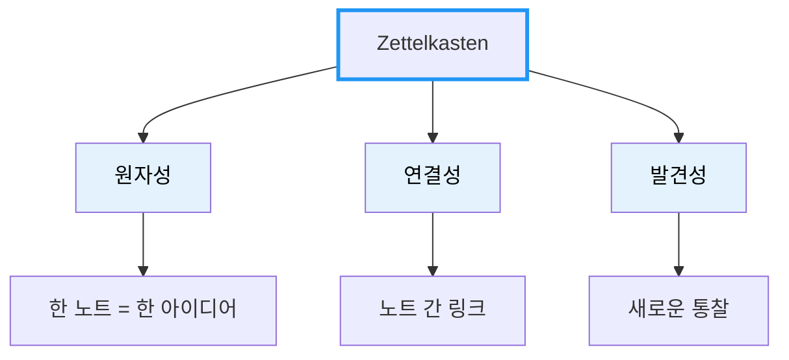

# Zettelkasten Note Writer

**원자적 노트로 지식을 연결하는 Obsidian 노트 작성 가이드**

---

## 핵심 철학

### 왜 Zettelkasten인가?

기존 노트 방식의 문제:
- 폴더에 묻혀 다시 보지 않는 노트
- 검색해도 찾기 어려운 정보
- 지식이 고립되어 새로운 통찰 불가

Zettelkasten의 해결책:
- **원자성**: 한 노트 = 한 아이디어 → 재사용 가능
- **연결성**: 노트 간 링크 → 지식 네트워크 형성
- **발견성**: 연결을 따라가며 새로운 통찰 발견

### 절대 하지 말 것
```
❌ 한 노트에 여러 개념 담기
❌ 출처 없이 정보 기록
❌ 복사-붙여넣기만 하고 재해석 없음
```

### 반드시 할 것
```
✅ 한 노트에 하나의 핵심 아이디어만
✅ 나의 언어로 재해석하여 작성
✅ frontmatter related_notes에 관련 노트 기록 (실존 확인)
```

---

## 기본 설정

| 항목 | 경로/규칙 |
|------|-----------|
| Vault 경로 | `~/Library/Mobile Documents/iCloud~md~obsidian/Documents/Note` |
| 템플릿 위치 | `99.Template/Zettelkasten` |
| 저장 위치 | `00.Inbox` |
| 파일명 규칙 | `{Title}.md` — 순수 제목, 접두사 없음 (예: `RAG 시스템 아키텍처.md`) |

---

## 글쓰기 스타일

### 페르소나

**시니어 엔지니어가 팀 테크톡에서 발표하는 톤.** 빅테크 엔지니어링 블로그(Netflix Tech Blog, Uber Engineering, Meta Engineering)의 어조를 참고한다.

### 5원칙

| 원칙 | 설명 |
|------|------|
| **문제부터 시작** | "이것이 뭔지" 전에 "왜 필요한지"부터. 문제의 맥락과 긴장감이 먼저 |
| **구체적 근거** | "성능이 좋다" → "추론 속도 3.7배, 메모리는 동일". 수치, 논문/블로그 출처로 뒷받침 |
| **Trade-off 분석** | 장점만 나열 금지. 무엇을 얻고 무엇을 포기하는지 반드시 함께 서술 |
| **판단을 담아라** | "A와 B가 있다"로 끝내지 말고, "이런 상황에선 A가 낫다, 왜냐하면~" 까지 |
| **실전 맥락** | 어떤 회사, 어떤 시스템, 어떤 규모에서 쓰이는지. 이론과 현실의 갭 서술 |

### 금지 패턴

```
❌ "~는 ~이다" 정의 반복 나열 (위키피디아 톤)
❌ "일반적으로", "보통", "대부분의 경우" — 헤징 표현
❌ 깊이 없는 불릿 포인트 나열 (항목만 있고 분석 없음)
❌ "먼저... 다음으로... 마지막으로..." 교과서식 전개
❌ 모든 문장이 평서문 — 리듬감 없는 단조로운 톤
```

### Before / After

```markdown
❌ Before (LLM 기본 톤):
MoE(Mixture of Experts)는 모델의 일부 파라미터만 활성화하여
연산 효율을 높이는 아키텍처입니다. 일반적으로 Router가
토큰을 적절한 Expert에 분배합니다.

✅ After (목표 톤):
GPT-4의 추론 비용이 어떻게 GPT-3.5 대비 합리적인 수준을 유지하는지
의아했다면, 답은 MoE에 있다. 1750억 파라미터를 전부 태우던 GPT-3와 달리,
MoE는 매 토큰마다 전체의 25%만 활성화한다. 메모리는 그대로 먹지만,
연산량은 1/4. 클라우드 사업자에게 이 차이는 서빙 비용의 차이다.
```

### 톤 체크 질문

노트 작성 후 스스로 점검:
- "이걸 읽은 동료가 흥미를 느낄까, 졸릴까?"
- "위키피디아랑 뭐가 다른가?"
- "내 판단과 분석이 들어가 있는가?"

---

## 노트 유형

### 1. Fleeting Note (순간 메모)
- 떠오르는 생각을 빠르게 기록
- 나중에 Permanent Note로 발전시키거나 삭제
- 저장 위치: `00.Inbox`

### 2. Literature Note (문헌 노트)
- 책, 강의, 아티클에서 얻은 정보
- 반드시 출처 명시
- 원문 인용 + 나의 해석 포함

### 3. Permanent Note (영구 노트)
- 완전히 내 언어로 재해석된 지식
- 다른 노트와 연결
- Zettelkasten의 핵심

---

## 노트 구조

### 파일명 규칙

```
{Title}.md

접두사(Prefix) 없이 순수한 설명적 제목만 사용.
분류는 tags와 [[wikilink]]로 처리.

예시:
  JPA 양방향 연관관계 매핑.md
  RAG 시스템 아키텍처.md
  PostgreSQL 인덱스 최적화.md
```

### Frontmatter 템플릿

```yaml
---
source:              # 출처 URL (있으면)
related_notes:       # wikilink 연결 (있으면)
  - "[[실존하는_노트1]]"
  - "[[실존하는_노트2]]"
tags:                # 계층형 태그
  - domain/topic
created: YYYY-MM-DD  # 작성일
---
```

### 본문 구조

필수 섹션과 자유 섹션으로 구성한다. 자유 섹션은 주제에 따라 유연하게 구성.

```markdown
## 핵심 아이디어                    ← [필수] hook. 왜 이게 중요한지, 한 문단으로 긴장감 있게
> 핵심을 한 문장으로. 정의가 아니라 통찰.

---

## {주제에 맞는 자유 섹션들}        ← [자유] 내용의 깊이를 담는 본문
- 섹션 제목은 주제에 맞게 자유롭게
- "상세 설명" 같은 제네릭 제목 지양
- 예: "Dense vs MoE — 구조적 차이", "Router의 문제와 해결책"
- ASCII 다이어그램, 비교표, 코드 블록 적극 활용
- trade-off와 판단을 반드시 포함. 근거(사례, 수치 등)로 뒷받침

---

## 더 알아보기                      ← [필수] 후속 탐구 방향
- 구체적인 후속 질문 (단순 키워드 나열 금지)
- "X와 Y의 관계는?", "Z가 실패하는 케이스는?" 형태
```

---

## 작성 프로세스

### 1단계: 리서치 (Tavily)

노트 작성 전 반드시 웹 리서치를 수행한다. LLM 내부 지식만으로 쓰면 깊이가 얕아진다.

```
tavily_search 수행:
  1차: "{주제}" — 개념 최신 동향, 주요 논문/발표
  2차: "{주제} engineering blog" 또는 "{주제} production" — 실전 사례
  3차 (선택): "{주제} comparison" 또는 "{주제} vs" — 비교/수치가 있는 주제인 경우

수집할 것:
  □ 실제 사용 사례 (어떤 회사, 어떤 규모)
  □ trade-off와 한계점
  □ 최신 동향과 변화 (기존 vs 현재)
  □ 구체적 수치가 있다면 함께 수집 (없어도 무방)
  □ 출처 URL (frontmatter source에 기록)
```

### 2단계: 기존 노트 조사
```markdown
□ 동일/유사 주제의 기존 노트 검색
□ 연결 가능한 관련 노트 식별 (frontmatter related_notes용)
□ 노트 범위를 원자적 단위로 제한
```

### 3단계: 집필
```markdown
□ 핵심 아이디어를 hook으로 — 정의가 아니라 "왜 이게 중요한지"
□ 리서치 결과를 종합하여 깊이 있는 본문 작성
□ 글쓰기 스타일 5원칙 준수
□ 출처 명시
```

### 4단계: 시각화 (필요시)
```markdown
□ 복잡한 개념은 mermaid 다이어그램 또는 ASCII 다이어그램으로
□ 비교표(table)로 trade-off를 한눈에
□ 가독성 있는 스타일 적용
```

---

## Mermaid 시각화 가이드

### 다이어그램 유형 선택

| 상황 | 다이어그램 |
|------|-----------|
| 프로세스/흐름 | `flowchart` |
| 시간순 상호작용 | `sequenceDiagram` |
| 클래스/구조 관계 | `classDiagram` |
| 상태 변화 | `stateDiagram-v2` |

### 스타일 가이드 (가독성 필수!)

```markdown
✅ 좋은 스타일:
- 테두리만 강조: style NodeName stroke:#2196F3,stroke-width:3px
- 어두운 배경 + 흰 글씨: style NodeName fill:#1565C0,color:#fff
- 밝은 배경 + 검은 글씨: style NodeName fill:#E3F2FD,color:#000

❌ 나쁜 스타일:
- style CF fill:#e1f5ff (밝은 배경에 자동 흰색 글씨 → 안 보임)
- style CF fill:#333,color:#666 (어두운 배경에 어두운 글씨 → 안 보임)
```

### 예시: 개념 관계도


```mermaid
flowchart TD
    A[Zettelkasten] --> B[원자성]
    A --> C[연결성]
    A --> D[발견성]

    B --> E[한 노트 = 한 아이디어]
    C --> F[노트 간 링크]
    D --> G[새로운 통찰]

    style A stroke:#2196F3,stroke-width:3px
    style B fill:#E3F2FD,color:#000
    style C fill:#E3F2FD,color:#000
    style D fill:#E3F2FD,color:#000
```

---

## 품질 기준

| 기준 | 설명 | 확인 질문 |
|------|------|-----------|
| **원자성** | 한 가지 핵심 아이디어만 | "이 노트를 더 쪼갤 수 있나?" |
| **독립성** | 단독으로도 이해 가능 | "맥락 없이 읽어도 이해되나?" |
| **연결성** | frontmatter related_notes 기록 | "어떤 노트와 관련있나?" |
| **재창조성** | 나의 언어로 재해석 | "출처 없이도 설명할 수 있나?" |
| **깊이** | 리서치 기반 근거와 실전 사례 포함 | "위키피디아보다 나은 점이 있나?" |
| **톤** | 엔지니어링 블로그 어조 | "동료가 읽으면 흥미를 느낄까?" |

---

## 완성 노트 예시

파일명: `CAP 정리와 분산 시스템 트레이드오프.md`

```markdown
---
source:
  - https://martin.kleppmann.com/2015/05/11/please-stop-calling-databases-cp-or-ap.html
related_notes:
  - "[[분산시스템의 트레이드오프]]"
  - "[[PACELC 정리]]"
tags:
  - database/replication
  - cs/architecture
created: 2024-01-15
---

## 핵심 아이디어

> CAP 정리를 "3개 중 2개를 고르는 문제"로 이해하고 있다면, 아마 잘못 이해하고 있을 확률이 높다. 실제로는 네트워크 파티션이 발생했을 때 일관성과 가용성 사이의 강제 선택이며, 정상 상태에서는 이 정리가 아무것도 말해주지 않는다.

---

## CAP을 벤 다이어그램으로 설명하면 안 되는 이유

인터넷의 거의 모든 CAP 설명이 "C, A, P 중 2개를 고르세요" 벤 다이어그램을 그린다. 문제는 이게 **근본적으로 틀렸다**는 것이다.

P(Partition Tolerance)는 선택이 아니다. 분산 시스템에서 네트워크 파티션은 **일어나는 일**이지, 포기할 수 있는 속성이 아니다. AWS us-east-1이 2025년에만 3번의 주요 네트워크 이슈를 겪었다는 사실을 생각하면, "파티션이 없는 분산 시스템"은 환상이다.

따라서 실제 선택지는 둘 뿐이다:
- **CP**: 파티션 발생 시 일부 요청을 거부. 틀린 답을 주느니 안 주겠다
- **AP**: 파티션 발생 시 오래된 데이터라도 응답. 안 주는 것보다 낫다

## 실전에서의 선택 — 서비스마다 다르다

같은 회사 안에서도 서비스별로 선택이 갈린다.

| 서비스 | 선택 | 이유 |
|--------|------|------|
| 은행 잔액 조회 | CP | 잔액 불일치는 금융 사고. 차라리 "일시적 장애" |
| 인스타그램 피드 | AP | 3초 전 게시물이 안 보이는 건 괜찮음. 앱이 안 열리는 건 재앙 |
| 재고 관리 (쿠팡) | 흥미로운 케이스 | 재고 0개인데 주문 허용 vs 재고 있는데 품절 표시. 비즈니스가 결정 |

마지막 케이스가 핵심인데, CP/AP는 기술적 선택처럼 보이지만 실제로는 **비즈니스 결정**이다. "잘못된 정보를 보여주는 비용"과 "서비스를 못 쓰는 비용" 중 뭐가 더 큰지의 문제.

## CAP 너머 — PACELC

CAP의 진짜 한계는, 파티션이 **없는** 정상 상태에서의 trade-off를 말해주지 않는다는 것이다. 정상 상태에서도 latency와 consistency는 충돌한다.

Daniel Abadi가 제안한 PACELC가 이걸 보완한다:
- **PA/EL**: 파티션 시 가용성, 정상 시 지연 최소화 (Cassandra, DynamoDB)
- **PC/EC**: 파티션 시 일관성, 정상 시에도 일관성 (MongoDB, HBase)

---

## 더 알아보기

- Martin Kleppmann의 "Please stop calling databases CP or AP" — CAP을 단순 분류 도구로 쓰는 관행에 대한 비판
- Google Spanner는 어떻게 "실질적 CA"를 구현했나? TrueTime API와 GPS 시계의 역할
- CockroachDB가 "Serializable + 고가용성"을 주장하는 근거는? 실제 파티션 상황에서의 동작
```

---

## 작성 후 체크리스트

```markdown
□ Tavily 리서치 수행 완료 (최소 2회 검색)
□ frontmatter source에 리서치 출처 기록
□ frontmatter 필수 항목 모두 작성
□ related_notes의 모든 링크가 실존하는 노트
□ 핵심 아이디어가 "정의"가 아닌 "통찰/hook"으로 시작
□ 주장에 근거(출처, 사례, 수치 등)가 있는가
□ trade-off 분석이 있는가 (장점만 나열 안 했는가)
□ 위키피디아 톤이 아닌 엔지니어링 블로그 톤인가
□ 파일명이 순수 제목 (접두사 없음)
□ created 날짜가 현재 날짜
□ mermaid 사용 시 가독성 확인
```
