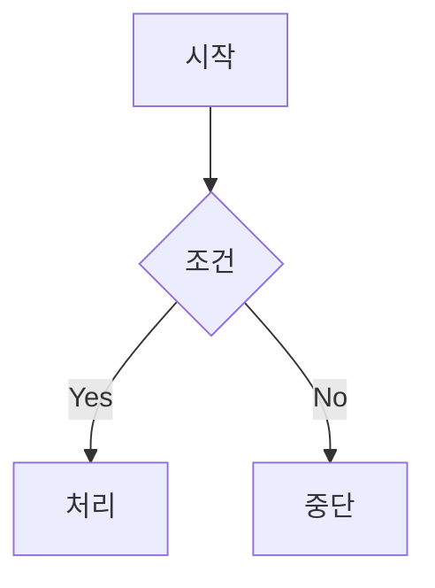
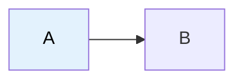

# Obsidian Flavored Markdown 문법 레퍼런스

Obsidian이 CommonMark/GFM 위에 추가한 고유 문법 정리. vault 규약(`related_notes`, `created`, 계층 태그)을 깨뜨리지 않도록 frontmatter 부분은 [SKILL.md](../SKILL.md)의 템플릿을 우선한다.

## 1. 내부 링크 (Wikilink)

| 문법 | 동작 |
|------|------|
| `[[Note Name]]` | 노트로 링크 |
| `[[Note Name\|표시 텍스트]]` | 표시 텍스트 변경 |
| `[[Note Name#Heading]]` | 특정 헤딩으로 링크 |
| `[[Note Name#^block-id]]` | 특정 블록으로 링크 |
| `[[#Heading]]` | 같은 노트 내 헤딩 |

vault 외부 URL은 표준 마크다운 `[text](url)` 사용. 내부 노트는 무조건 wikilink — Obsidian이 rename 시 자동 추적.

### Block ID 정의

```markdown
이 문단을 다른 노트에서 인용할 수 있다. ^my-block-id
```

리스트나 인용블록은 빈 줄 다음에 ID 배치:

```markdown
> 인용 블록

^quote-id
```

## 2. 임베드 (Embed)

wikilink 앞에 `!` 붙이면 인라인 임베드.

| 문법 | 동작 |
|------|------|
| `![[Note Name]]` | 노트 전체 임베드 |
| `![[Note Name#Heading]]` | 섹션만 임베드 |
| `![[Note Name#^block-id]]` | 특정 블록만 임베드 |
| `![[image.png]]` | 이미지 임베드 |
| `![[image.png\|300]]` | 가로 300px (비율 유지) |
| `![[image.png\|640x480]]` | 가로 x 세로 |
| `![[document.pdf]]` | PDF 임베드 |
| `![[document.pdf#page=3]]` | PDF 3페이지 |
| `![[document.pdf#height=400]]` | 표시 높이 400px |
| `![[audio.mp3]]` | 오디오 플레이어 |
| `` | 외부 이미지 |

### 검색 결과 임베드

````markdown
```query
tag:#project status:done
```
````

## 3. Callout

vault에서 자주 쓰는 강조 블록. **타입은 무조건 영어 키워드**, 한글 안 됨.

```markdown
> [!note]
> 기본 callout.

> [!warning] 커스텀 제목
> 제목을 직접 지정.

> [!faq]- 기본 접힘
> `-`로 끝나면 접힌 상태.

> [!faq]+ 기본 펼침
> `+`로 끝나면 펼친 상태.
```

### 중첩

```markdown
> [!question] 바깥
> > [!note] 안쪽
> > 중첩 가능.
```

### 타입 13종

| 타입 | 별칭 | 색상 / 용도 |
|------|------|------------|
| `note` | - | 파랑 / 일반 메모 |
| `abstract` | `summary`, `tldr` | 청록 / 요약 |
| `info` | - | 파랑 / 정보 |
| `todo` | - | 파랑 / 체크박스 |
| `tip` | `hint`, `important` | 청록 / 팁·중요 |
| `success` | `check`, `done` | 초록 / 완료 |
| `question` | `help`, `faq` | 노랑 / 질문·FAQ |
| `warning` | `caution`, `attention` | 주황 / 경고 |
| `failure` | `fail`, `missing` | 빨강 / 실패 |
| `danger` | `error` | 빨강 / 위험·에러 |
| `bug` | - | 빨강 / 버그 |
| `example` | - | 보라 / 예시 |
| `quote` | `cite` | 회색 / 인용 |

### 노트에서 자주 쓰는 패턴

- `[!tip]` — 핵심 원칙·기억해야 할 것
- `[!warning]` — 함정·gotcha
- `[!info]` — 부가 설명·맥락
- `[!example]` — 코드/use case 예시
- `[!quote]` — 출처 인용

## 4. 강조 / 주석

```markdown
==하이라이트 텍스트==                     배경 노란색 강조

이건 보임 %%이건 안 보임%% 이건 보임          인라인 주석

%%
이 블록 전체가 reading view에서 숨김.
%%
```

## 5. 수식 (LaTeX)

```markdown
인라인: $e^{i\pi} + 1 = 0$

블록:
$$
\frac{a}{b} = c
$$
```

## 6. 다이어그램 (Mermaid)



> [!warning] Mermaid 주의사항 (SKILL.md와 중복이지만 중요)
> - 밝은 배경: `color:#000` 명시 (미지정 시 흰 글씨로 안 보임)
> - 줄바꿈은 `<br>` (`\n`은 문자 그대로 출력됨)
> - subgraph 자체에는 style 불가 → 내부 노드에 개별 적용
> - Mermaid 노드를 Obsidian 노트로 링크: `class NodeName internal-link;`

## 7. 각주 (Footnote)

```markdown
본문 텍스트[^1].

[^1]: 각주 내용.

인라인 각주.^[이건 인라인이다.]
```

## 8. Frontmatter 속성 타입

> [!info] vault 규약 우선
> 일반적인 Obsidian frontmatter는 아래 타입을 지원하지만, **이 vault에서는 [SKILL.md](../SKILL.md)에 정의된 6필드(`source`, `related_notes`, `tags`, `created`, 선택적으로 `title`, `topics`)만 사용**한다. 임의로 `aliases`, `cssclasses` 같은 필드를 추가하지 말 것.

참고용 전체 타입:

| 타입 | 예시 |
|------|------|
| Text | `title: 제목` |
| Number | `rating: 4.5` |
| Checkbox | `completed: true` |
| Date | `date: 2024-01-15` |
| Date & Time | `due: 2024-01-15T14:30:00` |
| List | `tags: [a, b]` 또는 YAML 리스트 |
| Links | `related: "[[Other Note]]"` |

### 태그 문법

```markdown
#tag                       인라인 태그
#nested/tag                계층 태그 (vault 규약: 이 스타일 사용)
#tag-with-dashes
#tag_with_underscores
```

태그 문자: 글자(다국어 가능), 숫자(첫 글자 불가), `_`, `-`, `/`(중첩).

## 9. 완성 예시 (vault 규약 반영)

````markdown
---
source:
  - https://example.com/article
related_notes:
  - "[[관련 노트 A]]"
  - "[[관련 노트 B]]"
tags:
  - dev/architecture
  - cs/distributed
created: 2026-05-28
---

## 핵심 아이디어

> 한 문장 통찰을 quote로.

`[[관련 노트]]`로 연결하고, ==중요한 부분==은 하이라이트.

> [!tip] 핵심 원칙
> callout으로 강조할 가치 있는 내용.



![[참고-이미지.png|400]]

자세한 분석은 [[다른 노트#특정 헤딩]]에서. ^summary-block

---

## 더 알아보기

- 후속 질문 1
- 후속 질문 2
````

## References

- [Obsidian Flavored Markdown](https://help.obsidian.md/obsidian-flavored-markdown)
- [Internal links](https://help.obsidian.md/links)
- [Embed files](https://help.obsidian.md/embeds)
- [Callouts](https://help.obsidian.md/callouts)
- [Properties](https://help.obsidian.md/properties)
