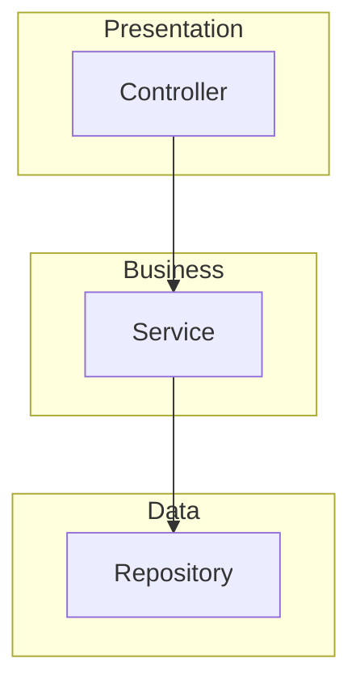

# Project Overview Skill

프로젝트의 구조, 기술 스택, 아키텍처를 체계적으로 분석하여 온보딩 정보를 제공합니다.

## 사용법

```bash
/project-overview                    # 기본 분석
/project-overview --depth deep       # 상세 분석
/project-overview --focus backend    # 백엔드 집중 분석
/project-overview --format summary   # 간략 요약
```

## Instructions

### Step 1: 옵션 파싱

| 옵션 | 값 | 설명 |
|------|-----|------|
| `--depth` | `shallow` (기본), `deep` | 분석 깊이 |
| `--focus` | `backend`, `frontend`, `api`, `database`, `testing`, `devops` | 집중 영역 |
| `--format` | `detailed` (기본), `summary` | 출력 형식 |

### Step 2: 프로젝트 메타데이터 수집

**필수 파일 확인:**

```bash
# 프로젝트 루트에서 확인할 파일들
ls -la README.md CLAUDE.md package.json pom.xml build.gradle \
       pyproject.toml requirements.txt go.mod Cargo.toml \
       .gitignore docker-compose.yml Dockerfile 2>/dev/null
```

**분석 대상:**

| 파일 | 추출 정보 |
|------|----------|
| `README.md` | 프로젝트 목적, 설치 방법 |
| `package.json` | Node.js 의존성, 스크립트 |
| `pom.xml` / `build.gradle` | Java 의존성, 빌드 설정 |
| `pyproject.toml` / `requirements.txt` | Python 의존성 |
| `docker-compose.yml` | 서비스 구성 |
| `.env.example` | 환경 변수 구조 |

### Step 3: 디렉토리 구조 분석

```bash
# 주요 디렉토리 구조 파악 (depth 2)
find . -type d -maxdepth 2 \
  ! -path "*/node_modules/*" \
  ! -path "*/.git/*" \
  ! -path "*/dist/*" \
  ! -path "*/build/*" \
  ! -path "*/__pycache__/*" \
  ! -path "*/.venv/*" \
  | head -50
```

### Step 4: 기술 스택 식별

**언어/프레임워크 감지:**

| 지표 | 기술 |
|------|------|
| `package.json` + `next.config.js` | Next.js |
| `package.json` + `angular.json` | Angular |
| `pom.xml` + `spring-boot` | Spring Boot |
| `build.gradle` + `org.springframework.boot` | Spring Boot |
| `pyproject.toml` + `fastapi` | FastAPI |
| `pyproject.toml` + `django` | Django |
| `go.mod` | Go |
| `Cargo.toml` | Rust |

### Step 5: 아키텍처 패턴 식별 (--depth deep)

**디렉토리 구조로 패턴 추론:**

| 구조 | 패턴 |
|------|------|
| `src/main/java/.../controller`, `service`, `repository` | Layered Architecture |
| `src/domain`, `src/application`, `src/infrastructure` | Clean/Hexagonal Architecture |
| `services/`, 각 서비스별 독립 폴더 | Microservices |
| `modules/` 또는 `packages/` | Modular Monolith |

### Step 6: 출력 문서 생성

---

## 출력 형식

### Summary 형식 (--format summary)

```markdown
# [프로젝트명] 개요

**목적**: [한 줄 설명]
**기술 스택**: [언어] + [프레임워크] + [DB]
**아키텍처**: [패턴]

## 빠른 시작
1. `[설치 명령어]`
2. `[실행 명령어]`

## 주요 디렉토리
- `src/` - 메인 소스 코드
- `tests/` - 테스트
```

### Detailed 형식 (기본)

```markdown
# [프로젝트명] 온보딩 가이드

## 📋 프로젝트 개요

| 항목 | 내용 |
|------|------|
| **목적** | [프로젝트 목적] |
| **타입** | [웹 앱 / API 서버 / 라이브러리 / CLI] |
| **상태** | [Active / Production / Maintenance] |

## 🛠 기술 스택

### 핵심 기술
| 구분 | 기술 | 버전 |
|------|------|------|
| 언어 | [언어] | [버전] |
| 프레임워크 | [프레임워크] | [버전] |
| 데이터베이스 | [DB] | [버전] |

### 개발 도구
- **빌드**: [빌드 도구]
- **패키지 관리**: [패키지 매니저]
- **테스트**: [테스트 프레임워크]
- **린터**: [린터/포매터]

## 📁 프로젝트 구조

```
프로젝트/
├── src/                 # 메인 소스 코드
│   ├── main/           # 프로덕션 코드
│   └── test/           # 테스트 코드
├── docs/               # 문서
├── scripts/            # 스크립트
└── config/             # 설정 파일
```

## 🏗 아키텍처

### 패턴
- **아키텍처 스타일**: [Layered / Hexagonal / Microservices]
- **설계 패턴**: [주요 패턴들]

### 모듈 구성


## 🚀 빠른 시작

### 사전 요구사항
- [필수 도구 및 버전]

### 설치 및 실행

```bash
# 1. 저장소 클론
git clone [repository-url]
cd [project-name]

# 2. 의존성 설치
[패키지 설치 명령어]

# 3. 환경 설정
cp .env.example .env
# .env 파일 수정

# 4. 실행
[실행 명령어]
```

## 🔧 주요 명령어

| 명령어 | 설명 |
|--------|------|
| `[명령어]` | [설명] |
| `[명령어]` | [설명] |

## 📚 핵심 모듈

### [모듈명 1]
- **위치**: `src/[경로]`
- **역할**: [설명]
- **주요 파일**: [파일 목록]

### [모듈명 2]
- **위치**: `src/[경로]`
- **역할**: [설명]

## 🔗 참고 자료

- [API 문서](링크)
- [위키](링크)
- [이슈 트래커](링크)
```

---

## Focus 옵션별 추가 분석

### --focus backend

- API 엔드포인트 목록
- 데이터베이스 스키마/엔티티
- 인증/인가 체계
- 외부 서비스 연동

### --focus frontend

- 컴포넌트 구조
- 상태 관리 방식
- 라우팅 구조
- 스타일링 방식

### --focus api

- 엔드포인트 목록 (REST/GraphQL)
- 요청/응답 형식
- 인증 방식
- API 버전 관리

### --focus database

- 엔티티/테이블 구조
- 관계 다이어그램
- 마이그레이션 방식
- 인덱스 전략

### --focus testing

- 테스트 구조
- 테스트 명령어
- 커버리지 현황
- 테스트 전략 (Unit/Integration/E2E)

### --focus devops

- CI/CD 파이프라인
- Docker 구성
- 환경별 설정
- 배포 전략

---

## 분석 제외 항목

다음 디렉토리는 자동으로 제외:

```
node_modules/
.git/
dist/
build/
target/
__pycache__/
.venv/
venv/
.idea/
.vscode/
*.log
```

---

## 사용 예시

### 새 프로젝트 파악

```bash
# 프로젝트 루트에서
/project-overview --depth deep
```

### 백엔드만 집중 분석

```bash
/project-overview --focus backend --depth deep
```

### 간단한 요약만

```bash
/project-overview --format summary
```

### 팀원 온보딩 문서 생성

```bash
/project-overview --depth deep
# 결과를 ONBOARDING.md로 저장
```
