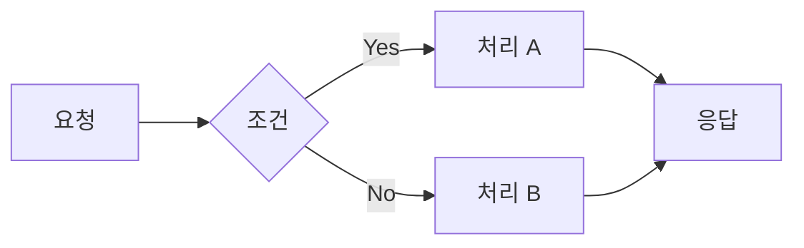
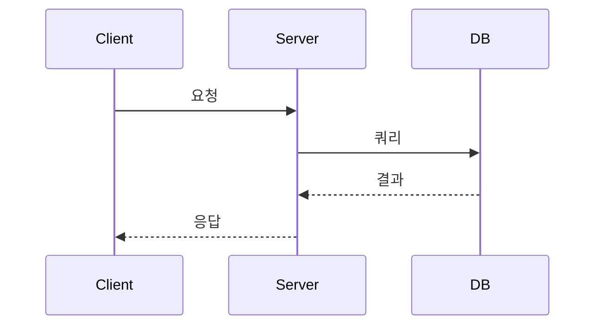

# Tech Blog Writer

**"왜"를 중심으로 비유와 스토리텔링으로 기술을 설명하는 블로그 글쓰기 가이드**

---

## 핵심 철학

### 절대 하지 말 것
```
❌ "A는 B이다. C는 D이다. E는 F이다." (단순 나열)
❌ 정의부터 시작하는 백과사전식 설명
❌ 논리적으로 맞지 않는 억지 비유
❌ 독자가 왜 이걸 알아야 하는지 모른 채 진행
```

### 반드시 할 것
```
✅ "왜 이게 필요한가?"부터 시작
✅ 독자가 아는 것 → 모르는 것으로 연결 (비유)
✅ 문제 상황 공감 → 해결책 제시 → 그 이유 설명
✅ 비유는 논리적 정확성 검증 후 사용
```

---

## 글 구조 템플릿

### 1단계: 후킹 도입 (독자의 관심 사로잡기)

**패턴 A: 문제 상황으로 시작**
```markdown
"여러분은 이런 경험이 있으신가요? [구체적 상황 묘사]"
"어느 날, [문제 발생]. 원인을 찾아보니..."
```

**패턴 B: 질문으로 시작**
```markdown
"왜 [기술/개념]이 필요할까요?"
"[기술 A]와 [기술 B]의 진짜 차이는 뭘까요?"
```

**패턴 C: 오해 바로잡기**
```markdown
"많은 개발자들이 [개념]을 [잘못된 이해]로 알고 있습니다. 하지만..."
"'[용어]'라는 이름 때문에 오해하기 쉽지만, 실제로는..."
```

**패턴 D: 실제 사례로 시작**
```markdown
"지난 주, 프로덕션에서 [문제]가 발생했습니다. 6시간의 디버깅 끝에..."
"면접에서 이런 질문을 받았습니다. '[질문]' 어떻게 대답하시겠어요?"
```

### 2단계: 본론 전개

**구조: 왜 → 무엇 → 어떻게**

```markdown
## 왜 필요한가? (Why)
- 이 기술/개념이 해결하는 문제
- 없으면 어떤 고통이 있는지
- 비즈니스/개발 관점의 필요성

## 핵심 개념 (What)
- 비유로 직관적 이해 제공
- 정확한 정의와 동작 원리
- 다른 개념과의 관계/차이점

## 실제 적용 (How)
- 코드 예시 또는 설정 방법
- 주의사항과 Best Practice
- 실제 사용 사례
```

### 3단계: 정리 및 마무리

```markdown
## 정리
> **핵심**: [한 문장으로 요약]

- 포인트 1
- 포인트 2
- 포인트 3

## 더 알아보기
- [심화 질문 1]?
- [심화 질문 2]?
- [관련 개념]과의 연결은?
```

---

## 비유 작성 가이드

### 좋은 비유의 조건

1. **논리적 대응**: 비유의 각 요소가 실제 개념과 1:1 대응
2. **친숙함**: 독자가 이미 잘 아는 상황/사물
3. **한계 인정**: 비유가 설명하지 못하는 부분 명시

### 검증된 비유 패턴

| 기술 개념 | 비유 | 대응 관계 |
|-----------|------|-----------|
| Blocking I/O | 음식점 카운터 | 주문 완료까지 다음 손님 대기 = Thread 점유 |
| Non-blocking I/O | 진동벨 | 음식 준비되면 알림 = Callback/Event |
| Index | 책의 색인 | 색인 없이 페이지 넘기기 vs 색인으로 바로 찾기 |
| Thread Pool | 은행 창구 | 창구 수 = Thread 수, 대기열 = Queue |
| Cache | 책상 위 자주 쓰는 책 | 서재(DB)까지 안 가도 됨 |
| Load Balancer | 놀이공원 줄서기 안내원 | 가장 짧은 줄로 안내 |
| Transaction | 은행 송금 | 전부 성공하거나 전부 취소 |
| Middleware | 공항 보안검색대 | 요청이 목적지 전에 거쳐가는 관문 |

### 비유 작성 시 체크리스트

```markdown
□ 이 비유의 각 요소가 실제 개념과 정확히 대응하는가?
□ 비유가 오히려 오해를 불러일으키지 않는가?
□ 독자가 이 비유 상황을 경험해본 적 있는가?
□ 비유의 한계점을 명시했는가?
```

### 비유 한계 명시 예시

```markdown
> 물론 이 비유에는 한계가 있습니다. 실제 [기술]에서는 [비유와 다른 점]이 있기 때문입니다. 하지만 [핵심 개념]을 이해하는 데는 충분합니다.
```

---

## "왜"를 설명하는 패턴

### 패턴 1: 문제 → 고통 → 해결책

```markdown
## 문제 상황
"기존 방식에서는 [문제]가 있었습니다."

## 그래서 뭐가 불편한데?
"이로 인해 [구체적 고통/비효율]이 발생합니다."

## 그래서 등장한 것이
"[기술/개념]은 이 문제를 [방법]으로 해결합니다."
```

### 패턴 2: 역사적 맥락

```markdown
## 탄생 배경
"[연도], [상황]에서 [인물/조직]이 [기술]을 만들었습니다."

## 왜 그때 필요했나?
"당시에는 [시대적 제약/요구사항]이 있었기 때문입니다."

## 현재의 의미
"지금도 [핵심 원리]는 여전히 유효합니다. 왜냐하면..."
```

### 패턴 3: 비교를 통한 필요성

```markdown
## A 방식 (기존)
- 장점: ...
- 단점: [이 부분이 문제]

## B 방식 (새로운)
- [A의 문제]를 해결
- 트레이드오프: ...

## 언제 뭘 써야 하나?
- A가 적합한 상황: ...
- B가 적합한 상황: ...
```

---

## 시각화 가이드

### Mermaid 다이어그램 활용

**흐름도 (프로세스 설명)**
```markdown

```

**시퀀스 다이어그램 (상호작용 설명)**
```markdown

```

**비교표 (개념 대조)**
```markdown
| 구분 | 방식 A | 방식 B |
|------|--------|--------|
| 특징 | ... | ... |
| 장점 | ... | ... |
| 단점 | ... | ... |
| 적합한 상황 | ... | ... |
```

### 코드 예시 규칙

```markdown
## 코드 예시 작성 순서
1. 먼저 개념을 비유/설명으로 이해시킨다
2. "코드로 보면 이렇습니다" 로 연결
3. 코드 제시
4. 코드의 각 부분이 개념과 어떻게 대응하는지 설명
```

---

## 글쓰기 체크리스트

### 도입부 검증
```markdown
□ 첫 문장에서 독자의 관심을 끄는가?
□ "왜 이 글을 읽어야 하는지" 3문단 내에 드러나는가?
□ 대상 독자가 공감할 문제/상황으로 시작하는가?
```

### 본문 검증
```markdown
□ "왜" → "무엇" → "어떻게" 순서를 따르는가?
□ 비유가 논리적으로 정확한가?
□ 단순 나열이 아닌 인과관계로 연결되는가?
□ 독자가 이미 아는 것에서 모르는 것으로 연결하는가?
□ 코드/다이어그램이 설명을 보완하는가?
```

### 마무리 검증
```markdown
□ 핵심 내용을 한 문장으로 요약했는가?
□ 독자가 다음에 뭘 해야 할지/알아야 할지 제시했는가?
□ 심화 학습 방향을 안내했는가?
```

### 전체 검증
```markdown
□ 글 전체를 처음부터 끝까지 읽었을 때 논리적 흐름이 자연스러운가?
□ 전문 용어를 처음 사용할 때 정의를 제공했는가?
□ 이 글을 읽은 독자가 "왜"를 설명할 수 있게 되었는가?
```

---

## 예시: Before & After

### Before (단순 나열)
```markdown
## Redis란?
Redis는 인메모리 데이터 저장소입니다. Key-Value 구조를 사용합니다.
다양한 데이터 타입을 지원합니다. String, List, Set, Hash 등이 있습니다.
싱글 스레드로 동작합니다. 빠른 성능을 제공합니다.
```

### After (왜 + 비유)
```markdown
## 왜 Redis가 필요할까?

데이터베이스에서 같은 데이터를 반복해서 읽어오는 상황을 상상해보세요.

마치 **도서관에서 책을 빌릴 때마다 서고 깊숙이 들어가는 것**과 같습니다.
자주 보는 책이라면 **책상 위에 두고 바로 꺼내 보는 게** 훨씬 빠르겠죠?

Redis가 바로 그 "책상"입니다.

- **서고 (디스크 DB)**: 용량 크지만 느림
- **책상 (Redis)**: 용량 작지만 빠름

자주 접근하는 데이터를 Redis에 두면, 매번 느린 DB까지 가지 않아도 됩니다.

> "그런데 왜 싱글 스레드인데 빠른 거예요?"

여기서 또 다른 비유가 필요합니다. [계속...]
```

---

## 글 작성 프로세스

```markdown
1. 주제 선정
   - 독자가 "왜"를 궁금해할 만한 주제인가?

2. 핵심 질문 정의
   - 이 글을 읽은 독자가 답할 수 있어야 할 질문은?

3. 비유 설계
   - 핵심 개념을 설명할 비유는?
   - 비유가 논리적으로 정확한가?

4. 구조 설계
   - 도입: 어떤 문제/질문으로 시작?
   - 본론: 왜 → 무엇 → 어떻게
   - 정리: 핵심 요약과 다음 단계

5. 시각화 계획
   - 다이어그램이 필요한 부분은?
   - 코드 예시가 필요한 부분은?

6. 초안 작성 → 검토 → 수정
```

---

## 자주 하는 실수

### 1. 비유의 논리적 오류
```markdown
❌ "Redis는 냉장고입니다" (왜 냉장고? 차갑다는 것 외에 연결점 없음)
✅ "Redis는 책상 위 메모지입니다" (빠른 접근, 임시 저장, 용량 제한 대응)
```

### 2. "왜" 없이 "무엇"만 설명
```markdown
❌ "인덱스는 B-Tree 구조로 되어 있습니다."
✅ "색인 없이 두꺼운 책에서 단어를 찾으려면 처음부터 넘겨야 합니다.
    인덱스가 있으면 바로 해당 페이지로 갈 수 있죠.
    DB 인덱스도 마찬가지입니다."
```

### 3. 독자 수준 무시
```markdown
❌ "당연히 알겠지만 CAS 연산은..."
✅ "CAS(Compare-And-Swap)는 [간단한 설명]. 처음 들어보셔도 괜찮습니다."
```

---

이 가이드를 따라 기술 블로그를 작성하면, 독자가 **"아, 그래서 이게 필요하구나"**를 느끼며 읽을 수 있습니다.
