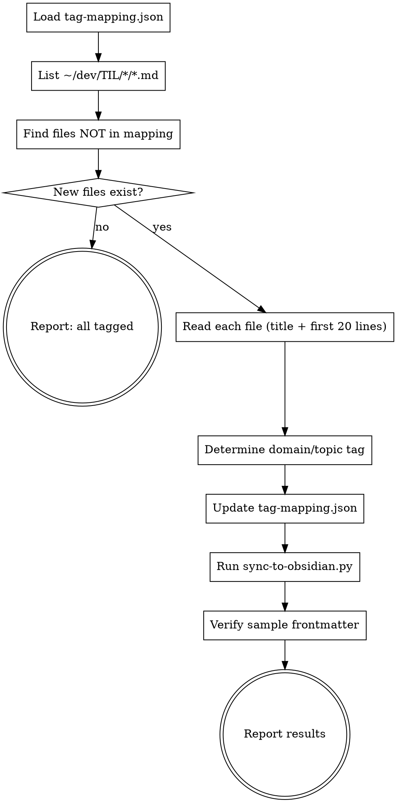

# TIL Tagger

Classify new TIL files into `domain/topic` tags and update `tag-mapping.json`.

## tag-mapping.json 형식

```json
{
  "파일명-without-extension": ["domain/topic"],
  "LangGraph-LLM-애플리케이션을-위한-상태-머신": ["ai/langgraph"],
  "Python-GIL-왜-존재할까": ["python/concurrency"]
}
```

- Key: 파일명 (확장자·디렉토리 제외, 하이픈 연결)
- Value: 태그 배열 (보통 1개, 드물게 2개)

## Paths

- **TIL repo:** `~/dev/TIL/`
- **Tag mapping:** `~/dev/TIL/tag-mapping.json`
- **Obsidian TIL:** `~/Library/Mobile Documents/iCloud~md~obsidian/Documents/Note/Wiki/`
- **Sync script:** `~/dev/TIL/.githooks/sync-to-obsidian.py`

## Process



### 1. Find untagged files

```bash
# List all TIL source files
find ~/dev/TIL -name "*.md" -not -path "*/.*" -not -name "README.md" -not -name "CLAUDE.md" -not -name "GEMINI.md" -not -path "*/scripts/*" | sort

# Compare against tag-mapping.json keys to find new entries
```

### 2. Classify tags

Read each untagged file's **title and first 20 lines**. Determine tag using:

| Signal | Example | Tag |
|--------|---------|-----|
| Directory name | `python/` | domain = `python` |
| Technology in title | `FastAPI-왜...` | `python/fastapi` |
| Library name | `LangGraph-...` | `ai/langgraph` |
| Concept keyword | `데이터베이스-인덱스-기초` | `database/index` |

**Tag format:** `domain/topic` (all lowercase, hyphen for multi-word)

**Existing domain examples:** `ai`, `python`, `java`, `spring`, `database`, `kubernetes`, `docker`, `devops`, `network`, `cs`, `frontend`, `backend`, `security`, `testing`, `web`, `infra`, `aws`, `redis`, `kafka`, `react`, `nodejs`, `javascript`, `design-pattern`, `economics`

### 3. Update and apply

```bash
# After updating tag-mapping.json:
cd ~/dev/TIL && python .githooks/sync-to-obsidian.py
```

### 4. Verify

Check 2-3 updated files to confirm `tags:` field has `domain/topic` format.

## Tag Guidelines

- One tag per file is sufficient; add second only if clearly dual-domain
- Reuse existing topics when possible (e.g., multiple index articles → `database/index`)
- New domain only if no existing domain fits
- Keep topic names short: `oop`, `asyncio`, `intro`, `ssh` — not full descriptions
