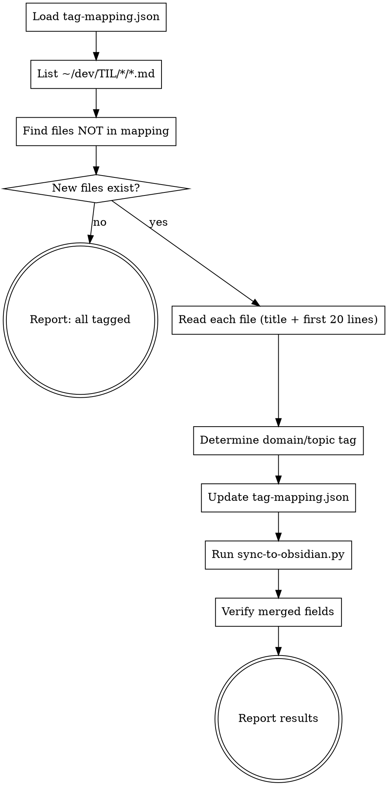

# TIL Tagger

Classify new TIL files into `domain/sub` tags and update `tag-mapping.json`.

공통 규칙: `~/.dotfiles/vault/references/note-rules.md` (2절 태그, 4절 TIL 파생 노트). 허용 분야·폴더별 기본 분야·rename 표는 `~/.dotfiles/vault/vault-policy.json`이 정본이다. 이 문서에 분야 목록을 적어 두지 않는다.

## tag-mapping.json 형식

```json
{
  "파일명-without-extension": ["domain/topic"],
  "LangGraph-LLM-애플리케이션을-위한-상태-머신": ["ai/langgraph"],
  "Python-GIL-왜-존재할까": ["python/concurrency"]
}
```

- Key: 파일명 (확장자·디렉토리 제외, 하이픈 연결)
- Value: 태그 배열 (보통 1개, 드물게 2개)

## Paths

- **TIL repo:** `~/dev/TIL/`
- **Tag mapping:** `~/dev/TIL/tag-mapping.json`
- **Obsidian TIL:** `~/Library/Mobile Documents/iCloud~md~obsidian/Documents/Note/Wiki/`
- **Sync script:** `~/dev/TIL/.githooks/sync-to-obsidian.py` (vaultkit.tilsync로 필드 단위 병합)
- **Policy:** `~/.dotfiles/vault/vault-policy.json`

## Process


```dot
digraph til_tagger {
    rankdir=TB;
    load [label="Load tag-mapping.json" shape=box];
    list [label="List ~/dev/TIL/*/*.md" shape=box];
    diff [label="Find files NOT in mapping" shape=box];
    check [label="New files exist?" shape=diamond];
    done_early [label="Report: all tagged" shape=doublecircle];
    read [label="Read each file (title + first 20 lines)" shape=box];
    classify [label="Determine domain/topic tag" shape=box];
    update [label="Update tag-mapping.json" shape=box];
    sync [label="Run sync-to-obsidian.py" shape=box];
    verify [label="Verify merged fields" shape=box];
    done [label="Report results" shape=doublecircle];

    load -> list -> diff -> check;
    check -> done_early [label="no"];
    check -> read [label="yes"];
    read -> classify -> update -> sync -> verify -> done;
}
```

### 1. Find untagged files

```bash
# List all TIL source files
find ~/dev/TIL -name "*.md" -not -path "*/.*" -not -name "README.md" -not -name "CLAUDE.md" -not -name "GEMINI.md" -not -name "AGENTS.md" -not -path "*/scripts/*" | sort

# Compare against tag-mapping.json keys to find new entries
```

### 2. Classify tags

Read each untagged file's **title and first 20 lines**. Determine tag using:

| Signal | Example | Tag |
|--------|---------|-----|
| Directory name | `python/`, `computer-science/` | domain = 폴더명, 단 policy `til_folder_domain`에 있으면 그 값 (`computer-science` → `cs`) |
| Technology in title | `FastAPI-왜...` | `python/fastapi` |
| Library name | `LangGraph-...` | `ai/langgraph` |
| Concept keyword | `데이터베이스-인덱스-기초` | `database/index` |

**Tag format:** 정확히 두 세그먼트 `domain/sub` (all lowercase, hyphen for multi-word). `til` 태그는 동기화가 자동으로 붙이므로 매핑에 넣지 않는다.

**Allowed domains:** policy에서 매번 읽는다. 목록 밖 분야는 쓰지 않는다.

```bash
jq -r '.tags.domains[]' ~/.dotfiles/vault/vault-policy.json
jq '.til_folder_domain' ~/.dotfiles/vault/vault-policy.json
```

`tags.rename`의 왼쪽(옛 태그)은 쓰지 않는다. 동기화가 policy로 정규화하지만, 매핑 자체를 처음부터 정규화된 값으로 둔다(`python3 ~/.dotfiles/vault/vk apply --til-mapping --dry-run`으로 확인).

### 3. Update and apply

```bash
# After updating tag-mapping.json: 먼저 판정만 확인
cd ~/dev/TIL && python3 .githooks/sync-to-obsidian.py --dry-run --verbose
# 결과를 사용자에게 보여 준 뒤 실제 동기화
cd ~/dev/TIL && python3 .githooks/sync-to-obsidian.py --verbose
```

평소에는 TIL 커밋 시 post-commit 훅이 `--diff` 모드로 동기화하므로 직접 실행하지 않아도 된다. 동기화 상태 파일(`Wiki/.til-sync-state.json`)이 없으면 스크립트는 `--dry-run`만 허용한다.

### 4. Verify

동기화는 필드 단위로 병합한다. 갱신된 Wiki 노트 2~3편을 열어 필드별로 확인한다.

| 필드 | 기대 값 |
|---|---|
| `tags` | `tag-mapping.json` 값을 policy로 정규화한 결과 + `til` |
| `title`·`source`·본문 | TIL 원본 값 |
| `topics` | TIL 폴더의 표시 이름(`vault-policy.json`의 `topics`, 예: `kubernetes` → `Kubernetes`) |
| `related_notes` | 동기화 전 Wiki 목록 유지 + TIL 본문 링크 중 목록에 없는 것만 뒤에 추가 |
| `created` | Wiki 값 유지(없으면 최초 동기화 날짜) |

- "Wiki 본문 수정됨 → TIL로 이관 필요": 본문은 Wiki 값을 유지하고 frontmatter(태그 포함)는 병합해 쓴 상태다. 태그 검증은 그대로 하고, 본문 수정을 TIL로 옮기라고 사용자에게 보고한다. TIL로 옮겨 커밋하면 다음 동기화에서 정상화된다.
- 이름 충돌(Wiki 전용 노트와 같은 이름): 해당 노트는 쓰이지 않았다. 사용자에게 그대로 보고한다.
- 마지막으로 `python3 ~/.dotfiles/vault/vk check`에서 해당 노트의 `[tag]` 위반(`untagged`, 허용 분야 밖)이 없는지 확인한다.

## Tag Guidelines

- One tag per file is sufficient; add second only if clearly dual-domain
- Reuse existing topics when possible (e.g., multiple index articles → `database/index`)
- New domain은 만들지 않는다. 맞는 분야가 없으면 policy `tags.domains` 추가를 사용자에게 제안한다
- Keep topic names short: `oop`, `asyncio`, `intro`, `ssh` — not full descriptions
